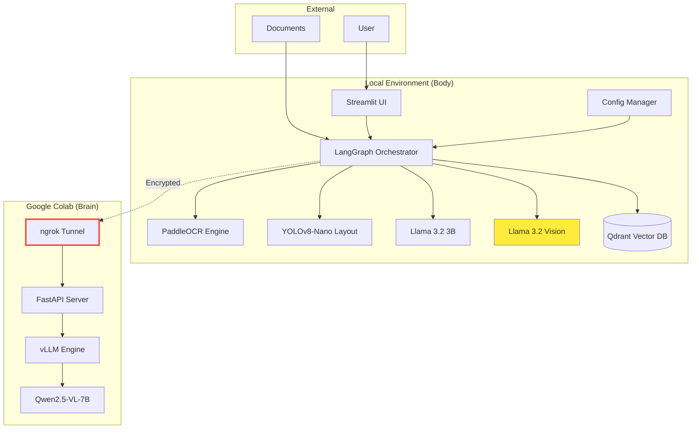

# Design Document

## Overview

Sovereign-Doc implements a hybrid multi-modal document intelligence architecture that balances privacy, cost-efficiency, and performance. The system consists of two primary components: a local "body" that handles document ingestion, preprocessing, and privacy-sensitive operations, and a remote "brain" running on Google Colab that provides GPU-accelerated vision model inference.

The architecture prioritizes data sovereignty by ensuring sensitive document content never leaves the local environment, while leveraging free cloud GPU resources for computationally intensive vision tasks through secure, encrypted tunneling.

## Architecture

### High-Level Architecture



### Component Responsibilities

**Local Body Components:**
- **LangGraph Orchestrator**: Multi-agent workflow coordination and state management
- **PaddleOCR Engine**: Text and table extraction with preprocessing
- **YOLOv8-Nano**: Document layout analysis and region segmentation  
- **Llama 3.2 3B**: Local text analysis and lightweight NLP tasks
- **Llama 3.2 Vision**: Fallback vision model for offline operation
- **Qdrant Vector DB**: Document embeddings storage and semantic search
- **Streamlit UI**: User interface and conflict resolution dashboard
- **Config Manager**: System configuration and environment adaptation

**Remote Brain Components:**
- **Qwen2.5-VL-7B**: Advanced vision-language model for complex visual reasoning
- **vLLM Engine**: Optimized inference engine for fast GPU utilization
- **FastAPI Server**: RESTful API for model inference requests
- **ngrok Tunnel**: Secure HTTPS tunnel for encrypted communication

## Components and Interfaces

### 1. Document Processing Pipeline

#### Input Interface
```python
class DocumentInput:
    file_path: str
    document_type: Optional[str]  # pdf, image, scan
    processing_mode: str  # local, hybrid, auto
    conflict_threshold: float = 0.15
```

#### Processing Stages
1. **Document Ingestion**: PDF parsing, image extraction, metadata collection
2. **Layout Analysis**: YOLOv8-Nano region detection with confidence scoring
3. **Text Extraction**: PaddleOCR with preprocessing pipeline
4. **Vision Analysis**: Qwen2.5-VL-7B inference via secure tunnel
5. **Conflict Detection**: Cross-modal validation and discrepancy calculation
6. **Resolution**: Automated resolution or user intervention via Streamlit UI

### 2. Multi-Agent Workflow System

#### LangGraph Agent Architecture
```python
class DocumentAgent:
    def __init__(self, agent_type: str, config: Dict):
        self.agent_type = agent_type  # ocr, vision, validator, resolver
        self.config = config
        
    async def process(self, document: Document) -> ProcessingResult:
        pass
        
    def confidence_score(self) -> float:
        pass
```

#### Agent Types
- **OCR Agent**: PaddleOCR text extraction with confidence scoring
- **Vision Agent**: Remote Qwen2.5-VL-7B inference coordination
- **Layout Agent**: YOLOv8-Nano region detection and classification
- **Validation Agent**: Cross-modal conflict detection and scoring
- **Resolution Agent**: Automated conflict resolution with user fallback

### 3. Secure Communication Layer

#### Tunnel Management
```python
class SecureTunnel:
    def __init__(self, ngrok_token: str):
        self.ngrok_token = ngrok_token
        self.tunnel_url: Optional[str] = None
        
    async def establish_connection(self) -> bool:
        # Verify Colab notebook is running
        # Establish ngrok tunnel
        # Test connectivity with health check
        pass
        
    async def send_inference_request(self, 
                                   image_data: bytes, 
                                   query: str) -> VisionResult:
        # Encrypt payload
        # Send via HTTPS
        # Validate response integrity
        pass
```

### 4. Vector Storage and Retrieval

#### Qdrant Integration
```python
class DocumentVectorStore:
    def __init__(self, collection_name: str):
        self.client = QdrantClient("localhost", port=6333)
        self.collection = collection_name
        
    async def store_document(self, 
                           document: Document, 
                           embeddings: List[float],
                           metadata: Dict) -> str:
        # Store with hierarchical metadata
        # document_id, page_number, section_type, confidence
        pass
        
    async def semantic_search(self, 
                            query: str, 
                            limit: int = 10) -> List[SearchResult]:
        # Hybrid search: BM25 + semantic similarity
        # BGE-small-en-v1.5 for text, CLIP for images
        pass
```

#### Multi-Document Querying

```python
class MultiDocumentQuery:
    def __init__(self, vector_store: DocumentVectorStore):
        self.store = vector_store
        
    async def cross_document_search(self,
                                   query: str,
                                   document_ids: Optional[List[str]] = None,
                                   group_by: str = "document") -> MultiDocResult:
        """
        Search across multiple documents and group results.
        """
        
        # Retrieve relevant chunks
        results = await self.store.semantic_search(query, limit=50)
        
        # Filter by document_ids if specified
        if document_ids:
            results = [r for r in results if r.metadata["document_id"] in document_ids]
        
        # Group results
        if group_by == "document":
            grouped = self._group_by_document(results)
        elif group_by == "section_type":
            grouped = self._group_by_section(results)
        
        return MultiDocResult(
            query=query,
            grouped_results=grouped,
            total_documents=len(set(r.metadata["document_id"] for r in results))
        )
        
    async def comparative_analysis(self,
                                  field_name: str,
                                 document_ids: List[str]) -> ComparativeResult:
        """
        Example: "Compare Q1 revenue across all quarterly reports"
        """
        
        results = {}
        for doc_id in document_ids:
            # Search for specific field in each document
            query = f"{field_name} value"
            matches = await self.store.semantic_search(
                query, 
                filter={"document_id": doc_id},
                limit=5
            )
            
            # Extract numeric values
            values = self._extract_numeric_values(matches, field_name)
            results[doc_id] = values
        
        return ComparativeResult(
            field=field_name,
            values_by_document=results,
            trend_analysis=self._analyze_trend(results)
        )
```

### 5. User Interface System

#### Streamlit Dashboard Architecture

```python
class SovereignDocUI:
    def __init__(self):
        self.session_state = st.session_state
        
    def render_main_dashboard(self):
        # Three-column layout
        col1, col2, col3 = st.columns([2, 2, 1])
        
        with col1:
            self.render_document_viewer()  # PDF with bounding boxes
            
        with col2:
            self.render_extraction_results()  # Structured data
            
        with col3:
            self.render_conflict_panel()  # Conflict resolution controls
            
    def render_conflict_panel(self):
        conflicts = self.get_pending_conflicts()
        
        for conflict in conflicts:
            st.markdown(f"### Conflict {conflict.id}")
            st.markdown(f"**Region:** {conflict.region_id}")
            
            # Side-by-side comparison
            col_a, col_b = st.columns(2)
            with col_a:
                st.metric("OCR Value", conflict.text_value)
                st.caption(f"Confidence: {conflict.confidence_scores['text']:.1%}")
                
            with col_b:
                st.metric("Vision Value", conflict.vision_value)
                st.caption(f"Confidence: {conflict.confidence_scores['vision']:.1%}")
            
            # Discrepancy indicator
            st.error(f"Discrepancy: {conflict.discrepancy_percentage:.1%}")
            
            # Resolution buttons
            col_btn1, col_btn2, col_btn3 = st.columns(3)
            with col_btn1:
                if st.button("Accept OCR", key=f"ocr_{conflict.id}"):
                    self.resolve_conflict(conflict, "text")
            with col_btn2:
                if st.button("Accept Vision", key=f"vis_{conflict.id}"):
                    self.resolve_conflict(conflict, "vision")
            with col_btn3:
                manual_value = st.text_input("Manual", key=f"man_{conflict.id}")
                if st.button("Override", key=f"ovr_{conflict.id}"):
                    self.resolve_conflict(conflict, "manual", manual_value)
```

#### UI Pages

1. **Document Upload Page**:
   - Drag-and-drop file upload
   - Batch upload support
   - Processing mode selector (local/hybrid/auto)
   - Configuration overrides (conflict threshold, batch size)

2. **Processing Monitor Page**:
   - Real-time progress bar with stage indicators
   - Live log stream showing agent activities
   - Resource usage graphs (CPU, RAM, GPU if applicable)
   - Estimated time remaining

3. **Conflict Resolution Page**:
   - Priority-sorted conflict queue
   - Side-by-side visual comparison
   - Source region highlighting in original PDF
   - Resolution history tracking

4. **Results Export Page**:
   - Structured data preview (JSON tree view)
   - Export format selection (JSON/Excel/Markdown)
   - Confidence score distribution chart
   - Processing summary statistics

## Data Models

### Core Document Model
```python
@dataclass
class Document:
    id: str
    file_path: str
    pages: List[Page]
    metadata: DocumentMetadata
    processing_status: ProcessingStatus
    created_at: datetime
    
@dataclass
class Page:
    page_number: int
    regions: List[Region]
    raw_image: bytes
    processed_image: Optional[bytes]
    
@dataclass
class Region:
    id: str
    bbox: BoundingBox  # x, y, width, height
    region_type: str  # text, table, image, chart
    content: Union[TextContent, TableContent, ImageContent]
    confidence: float
    extraction_method: str  # ocr, vision, hybrid
```

### Conflict Detection Model
```python
@dataclass
class Conflict:
    id: str
    region_id: str
    conflict_type: str  # value_mismatch, confidence_low, method_disagreement
    text_value: Any
    vision_value: Any
    discrepancy_percentage: float
    confidence_scores: Dict[str, float]
    resolution_status: str  # pending, resolved, flagged
    resolution_method: Optional[str]  # auto, manual, user_override
    
@dataclass
class ConflictResolution:
    conflict_id: str
    chosen_value: Any
    resolution_method: str
    user_id: Optional[str]
    timestamp: datetime
    confidence: float
```

### Configuration Model
```python
@dataclass
class SystemConfig:
    processing_mode: str = "hybrid"  # local, hybrid, remote
    conflict_threshold: float = 0.15
    batch_size: int = 5
    max_memory_usage: float = 0.85
    
    # Hardware-specific settings
    cpu_cores: int = 4
    available_ram_gb: int = 8
    has_gpu: bool = False
    
    # Model settings
    ocr_confidence_threshold: float = 0.6
    vision_confidence_threshold: float = 0.7
    
    # Colab settings
    ngrok_url: Optional[str] = None
    tunnel_timeout: int = 30
    
    # Qdrant settings
    vector_collection: str = "documents"
    embedding_model: str = "BGE-small-en-v1.5"
```

## Conflict Detection and Resolution System

### Detection Algorithm

The Conflict Detection Agent implements a three-stage validation pipeline:

#### Stage 1: Value Extraction
```python
class ConflictDetector:
    async def extract_values(self, region: Region) -> Tuple[Any, Any]:
        # Extract from text modality
        text_value = await self.ocr_agent.extract_numeric(region)
        
        # Extract from vision modality
        vision_value = await self.vision_agent.extract_numeric(region)
        
        return text_value, vision_value
```

#### Stage 2: Normalization
```python
def normalize_values(self, text_val: Any, vision_val: Any) -> Tuple[float, float]:
    # Convert to common units (M, B, K)
    # Handle percentages vs absolute values
    # Account for rounding differences (5.2M vs 5.23M)
    
    # Example: "$5.2M" -> 5200000.0
    # Example: "Chart shows ~5M" -> 5000000.0
    pass
```

#### Stage 3: Discrepancy Calculation
```python
def calculate_discrepancy(self,
                         text_val: float,
                         vision_val: float,
                         threshold: float = 0.15) -> Optional[Conflict]:
    if text_val == 0 and vision_val == 0:
        return None  # Both empty, no conflict
    
    max_val = max(abs(text_val), abs(vision_val))
    if max_val == 0:
        return None
    
    delta = abs(text_val - vision_val) / max_val
    
    if delta > threshold:
        return Conflict(
            discrepancy_percentage=delta,
            text_value=text_val,
            vision_value=vision_val,
            conflict_type="value_mismatch"
        )
    return None
```

### Resolution Strategies

1. **High-Confidence Auto-Resolution**: If one modality has confidence >0.9 and the other <0.6 → Accept high-confidence value

2. **Contextual Resolution**: 
   - If text explicitly references "See Chart 1" → Prefer vision value
   - If chart is blurry (low image quality score) → Prefer text value

3. **Human-in-the-Loop**: 
   - If both confidences >0.7 but values conflict → Flag for manual review
   - Display side-by-side comparison in Streamlit UI
   - User selects: Accept Text | Accept Vision | Manual Override

### Conflict Prioritization

Conflicts are prioritized for user review based on impact score:

```python
def calculate_impact_score(conflict: Conflict, region: Region) -> float:
    # Higher priority for financial figures
    impact = 1.0 if region.region_type == "table" else 0.5
    
    # Scale by discrepancy magnitude
    impact *= min(conflict.discrepancy_percentage, 1.0)
    
    # Boost if both confidences are high (genuine disagreement)
    if conflict.confidence_scores["text"] > 0.7 and \
       conflict.confidence_scores["vision"] > 0.7:
        impact *= 1.5
    
    return impact
```

## Multi-Agent Workflow System

### LangGraph Workflow Definition

```python
from langgraph.graph import StateGraph, END

class DocumentProcessingState(TypedDict):
    document: Document
    layout_regions: List[Region]
    ocr_results: Dict[str, TextContent]
    vision_results: Dict[str, ImageContent]
    conflicts: List[Conflict]
    resolutions: List[ConflictResolution]
    processing_stage: str
    error_log: List[str]

def create_processing_graph() -> StateGraph:
    workflow = StateGraph(DocumentProcessingState)
    
    # Define nodes
    workflow.add_node("layout_analysis", layout_analysis_node)
    workflow.add_node("parallel_extraction", parallel_extraction_node)
    workflow.add_node("conflict_detection", conflict_detection_node)
    workflow.add_node("auto_resolution", auto_resolution_node)
    workflow.add_node("human_review", human_review_node)
    workflow.add_node("vectorize_and_store", storage_node)
    
    # Define edges
    workflow.set_entry_point("layout_analysis")
    
    workflow.add_edge("layout_analysis", "parallel_extraction")
    workflow.add_edge("parallel_extraction", "conflict_detection")
    
    # Conditional routing based on conflicts
    workflow.add_conditional_edges(
        "conflict_detection",
        route_conflicts,  # Function that decides next step
        {
            "auto_resolve": "auto_resolution",
            "needs_review": "human_review",
            "no_conflicts": "vectorize_and_store"
        }
    )
    
    workflow.add_edge("auto_resolution", "vectorize_and_store")
    workflow.add_edge("human_review", "vectorize_and_store")
    workflow.add_edge("vectorize_and_store", END)
    
    return workflow.compile()

def route_conflicts(state: DocumentProcessingState) -> str:
    """Determine conflict resolution path."""
    if not state["conflicts"]:
        return "no_conflicts"
    
    # Check if all conflicts can be auto-resolved
    high_impact_conflicts = [
        c for c in state["conflicts"] 
        if calculate_impact_score(c) > 0.7
    ]
    
    if high_impact_conflicts:
        return "needs_review"
    return "auto_resolve"
```

### Workflow Visualization

```
Document Input
     ↓
Layout Analysis (YOLO)
     ↓
Parallel Extraction
   ├─→ OCR Agent (PaddleOCR)
   └─→ Vision Agent (Qwen2.5-VL)
     ↓
Conflict Detection
     ↓
  ┌──┴──┐
  │ Has │
  │Conflicts?│
  └──┬──┘
     ├─→ No → Store in Qdrant
     ├─→ Yes (Low Impact) → Auto-Resolve → Store
     └─→ Yes (High Impact) → Human Review → Store
```

## Error Handling

### Graceful Degradation Strategy

#### 1. Colab Connection Failures
```python
class ColabFailureHandler:
    async def handle_connection_loss(self):
        # Detect failure within 30 seconds
        # Switch to local Llama 3.2 Vision
        # Log degradation event
        # Continue processing with reduced capabilities
        pass
```

#### 2. OCR Confidence Issues
```python
class OCREnhancer:
    async def enhance_low_confidence_text(self, image: bytes) -> str:
        # Apply preprocessing: denoise, sharpen, binarization
        # Retry OCR with enhanced image
        # If still low confidence, flag for manual review
        pass
```

#### 3. Memory Management
```python
class ResourceManager:
    def monitor_resources(self):
        # Track CPU, RAM, GPU usage
        # Implement cool-down mode at 90% RAM
        # Switch to streaming mode for large documents
        # Unload models when idle
        pass
```

### Fallback Decision Tree

```python
class FallbackManager:
    def select_processing_mode(self,
                              config: SystemConfig,
                              health_status: Dict) -> ProcessingMode:
        """
        Decision tree for selecting optimal processing mode.
        """
        
        # 1. Check if hybrid mode is available
        if config.processing_mode == "hybrid":
            if health_status["colab_available"]:
                if health_status["tunnel_latency"] < 2000:  # ms
                    return ProcessingMode.HYBRID
                else:
                    logger.warning("High tunnel latency, falling back to local")
                    return ProcessingMode.LOCAL
            else:
                logger.warning("Colab unavailable, using local mode")
                return ProcessingMode.LOCAL
        
        # 2. Check if local GPU available for vision tasks
        if config.has_gpu and health_status["gpu_memory_free"] > 8000:  # MB
            return ProcessingMode.LOCAL_GPU
        
        # 3. Default to CPU-only local mode
        return ProcessingMode.LOCAL_CPU
        
    def handle_inference_failure(self,
                                failure_type: str,
                               retry_count: int) -> InferenceStrategy:
        """
        Progressive fallback for inference failures.
        """
        
        if failure_type == "colab_timeout":
            if retry_count < 3:
                # Retry with exponential backoff
                return InferenceStrategy.RETRY_COLAB
            else:
                # Switch to local vision model
                return InferenceStrategy.USE_LOCAL_VISION
        
        elif failure_type == "low_confidence":
            if retry_count < 2:
                # Apply image preprocessing and retry
                return InferenceStrategy.PREPROCESS_AND_RETRY
            else:
                # Flag for human review
                return InferenceStrategy.FLAG_FOR_REVIEW
        
        elif failure_type == "memory_overflow":
            # Switch to streaming mode
            return InferenceStrategy.USE_STREAMING_MODE
        
        else:
            # Unknown failure, log and continue
            return InferenceStrategy.SKIP_AND_LOG
```

### Fallback Hierarchy (Best to Worst)

1. **Hybrid Mode (Colab GPU)** - Best quality, free, requires internet
2. **Local GPU Mode** - Good quality, no latency, requires compatible GPU
3. **Local CPU Mode (Llama 3.2 Vision)** - Acceptable quality, slow
4. **OCR-Only Mode** - Text extraction only, no vision analysis
5. **Skip Document** - Last resort for corrupted/incompatible files

### Error Recovery Mechanisms

#### Checkpoint System
```python
class ProcessingCheckpoint:
    def save_state(self, document_id: str, stage: str, data: Dict):
        # Save processing state to disk
        # Enable recovery from interruptions
        pass
        
    def restore_state(self, document_id: str) -> Optional[Dict]:
        # Restore from last successful checkpoint
        # Resume processing from interruption point
        pass
```

## Testing Strategy

### 1. Unit Testing
- **Component Tests**: Individual agent functionality
- **Model Tests**: OCR accuracy, vision inference, conflict detection
- **Integration Tests**: Agent coordination, data flow validation

### 2. Performance Testing
```python
class PerformanceBenchmark:
    def __init__(self):
        self.test_documents = [
            "test_data/sec_10k_reports/*.pdf",
            "test_data/arxiv_papers/*.pdf", 
            "test_data/invoices/*.pdf"
        ]
        
    async def run_accuracy_benchmark(self) -> BenchmarkResult:
        # Process test set with ground truth
        # Calculate IoU for table detection (target: >0.85)
        # Calculate CER for OCR (target: <8%)
        # Measure chart extraction accuracy (±10% tolerance)
        pass
        
    async def run_performance_benchmark(self) -> PerformanceMetrics:
        # Measure processing time per page
        # Track memory usage patterns
        # Monitor GPU utilization (Colab)
        # Validate response times (<500ms for vector search)
        pass
```

### 3. Integration Testing
- **End-to-End Workflows**: Document upload → processing → conflict resolution → export
- **Failure Scenarios**: Colab disconnection, memory exhaustion, corrupted documents
- **Security Testing**: Tunnel encryption, data isolation, temporary file cleanup

### 4. User Acceptance Testing
```python
class DemoScenarios:
    scenarios = [
        "financial_report_with_chart_table_conflicts",
        "academic_paper_with_complex_figures", 
        "invoice_batch_processing_with_errors",
        "multi_document_comparative_analysis"
    ]
```

## Performance Targets and Benchmarks

### Processing Speed Targets

| Document Type | Pages | Target Time | Acceptable Range |
|---------------|-------|-------------|------------------|
| **Clean PDF** | 10 | 2-3 minutes | 1.5-4 minutes |
| **Scanned Document** | 10 | 4-5 minutes | 3-6 minutes |
| **Complex Financial Report** | 50 | 12-15 minutes | 10-20 minutes |

**Breakdown per page (hybrid mode):**
- Layout Analysis (YOLO): 0.5-1s
- OCR Extraction: 3-5s
- Vision Inference (Colab): 2-4s
- Conflict Detection: 0.5-1s
- **Total: ~8-12s per page**

**Local-only mode (fallback):**
- Vision Inference (Llama 3.2 Vision): 15-20s
- **Total: ~25-30s per page**

### Accuracy Targets

| Metric | Target | Baseline (Tesseract-only) | Commercial (AWS Textract) |
|--------|--------|---------------------------|---------------------------|
| **Table Detection IoU** | >0.85 | 0.72 | 0.93 |
| **OCR CER (Clean)** | <8% | 12% | 3% |
| **OCR CER (Scanned)** | <15% | 25% | 8% |
| **Chart Value Extraction** | ±10% tolerance | N/A (text-only) | ±5% |
| **Conflict Detection Recall** | >90% | N/A | N/A |

### Resource Usage Targets

**Local Environment:**
- Peak RAM: <6GB (out of 8GB minimum)
- CPU Usage: 60-80% during processing, <10% idle
- Disk I/O: <100MB/s (sequential read)

**Colab Environment:**
- GPU Memory: <12GB (T4 has 16GB)
- GPU Utilization: >80% during inference
- Network Bandwidth: <5MB/s (for tunnel communication)

### Scalability Projections

**Single Worker (Current Architecture):**
- Throughput: ~120-180 pages/hour
- Daily capacity: ~2,000-3,000 pages (16hr operation)

**Horizontal Scaling (5 Colab Sessions):**
- Throughput: ~600-900 pages/hour
- Daily capacity: ~10,000-15,000 pages
- Additional cost: $0 (if using free tier) or $7.50/day (spot instances)

## Security Considerations

### 1. Data Privacy
- **Local Processing**: Sensitive documents never transmitted to external services
- **Encrypted Communication**: All tunnel traffic uses HTTPS with certificate validation
- **Ephemeral Cloud**: Colab instances automatically terminated after sessions
- **Temporary File Management**: Automatic cleanup of all temporary files

### 2. Access Control
- **Token-Based Authentication**: Temporary tokens for Colab API access
- **Environment Variables**: Sensitive configuration stored in environment variables
- **Audit Logging**: Complete processing history with privacy-safe metadata

### 3. Network Security
```python
class SecurityManager:
    def validate_tunnel_certificate(self, url: str) -> bool:
        # Verify SSL certificate validity
        # Check certificate chain
        # Validate ngrok domain authenticity
        pass
        
    def encrypt_payload(self, data: bytes) -> bytes:
        # Additional encryption layer for sensitive data
        # Key rotation for long-running sessions
        pass
```

## Deployment Architecture

### Local Environment Setup
```yaml
# docker-compose.yml for Qdrant
version: '3.8'
services:
  qdrant:
    image: qdrant/qdrant:latest
    ports:
      - "6333:6333"
    volumes:
      - ./qdrant_data:/qdrant/storage
    environment:
      - QDRANT__SERVICE__HTTP_PORT=6333
```

### Colab Notebook Structure
```python
# colab_brain.ipynb
# 1. Environment setup and model loading
# 2. FastAPI server initialization  
# 3. ngrok tunnel establishment
# 4. Health check endpoints
# 5. Vision inference endpoints
# 6. Graceful shutdown handling
```

### Configuration Management
```yaml
# config.yaml
system:
  processing_mode: "hybrid"
  conflict_threshold: 0.15
  batch_size: 5
  max_memory_usage: 0.85

models:
  ocr:
    engine: "paddleocr"
    confidence_threshold: 0.6
  vision:
    primary: "qwen2.5-vl-7b"
    fallback: "llama3.2-vision"
    confidence_threshold: 0.7
  embedding:
    text_model: "BGE-small-en-v1.5"
    image_model: "clip-vit-base-patch32"

hardware:
  auto_detect: true
  cpu_cores: 4
  ram_gb: 8
  gpu_available: false

colab:
  ngrok_url: null  # Set at runtime
  tunnel_timeout: 30
  health_check_interval: 60

qdrant:
  host: "localhost"
  port: 6333
  collection: "documents"
  vector_size: 384
```

This design addresses all 16 requirements through a robust, scalable architecture that balances privacy, performance, and cost-effectiveness while providing comprehensive error handling and testing strategies.