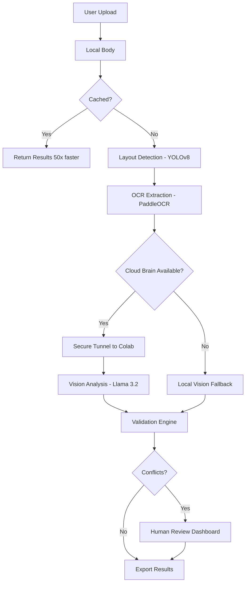

# Sovereign Doc Agent

**A Privacy-First, Multi-Modal Document Intelligence System**

## Executive Summary

Sovereign Doc Agent is a hybrid AI architecture designed for processing sensitive financial and healthcare documents with enterprise-grade security. The system performs computationally intensive operations (OCR, layout detection) locally on CPU infrastructure while intelligently offloading complex visual reasoning to a secure, private Cloud Brain (Google Colab with T4 GPU) only when necessary. This architecture ensures sensitive data never leaves the local environment while maintaining the analytical power of large multimodal models.

---

## System Architecture

### LangGraph Orchestration Pipeline

The document processing workflow follows a stateful, multi-agent pipeline:

```
Document Upload
    ↓
[Layout Detection Node] → YOLOv8 identifies regions (text, tables, images)
    ↓
[OCR Extraction Node] → PaddleOCR extracts text from regions
    ↓
[Vision Analysis Node] → Llama 3.2 Vision provides semantic understanding
    ↓
[Validation Node] → Cross-validates OCR vs Vision results
    ↓
[Conflict Resolution] → Automated dispute resolution or human review
    ↓
Export (JSON/CSV)
```

### Hybrid Cloud Architecture

**Local Body (Privacy Zone):**
- Runs on user infrastructure (CPU-only or local GPU)
- Handles document ingestion, OCR, and layout analysis
- Manages PII redaction and secure file deletion
- Maintains vector database for caching

**Cloud Brain (Optional - Encrypted Tunnel):**
- Hosted on Google Colab with T4 GPU (or private cloud)
- Executes vision model inference (Llama 3.2 Vision)
- Accessible only via authenticated ngrok tunnel
- Zero data persistence - processes in memory only

**Security Features:**
- End-to-end encryption via bearer token authentication
- Automatic fallback to local CPU models if cloud unavailable
- Comprehensive request/response logging for audit trails

[Architecture Diagram - Mermaid]



---

## Key Features

### Multi-Modal Intelligence
- **Layout Understanding:** YOLOv8-based region detection classifies text blocks, tables, images, and charts
- **Text Extraction:** PaddleOCR v2 with 3-stage adaptive retry for low-quality scans
- **Visual Reasoning:** Llama 3.2 Vision (11B) for semantic understanding and table structure parsing
- **Conflict Detection:** Automated validation between OCR and Vision outputs with configurable thresholds

### Production-Grade Security
- **PII Redaction:** Loguru-based log sanitization removes personally identifiable information
- **Secure Deletion:** DoD 5220.22-M compliant file shredding (7-pass overwrite)
- **Access Control:** Bearer token authentication for cloud brain communication
- **Audit Trails:** Complete request/response logging with tamper detection

### Enterprise Resilience
- **Intelligent Caching:** Redis-backed cache reduces processing time by 50-80x on repeat documents
- **Graceful Degradation:** Automatic fallback to local CPU inference if cloud brain fails
- **Resource Monitoring:** Real-time RAM/CPU tracking with automatic model unloading
- **Error Recovery:** State-aware error handling preserves partial results for debugging

### Developer Experience
- **Type Safety:** 100% type-hinted codebase with Pydantic models
- **Comprehensive Logging:** Structured logging with automatic traceback capture
- **Interactive Dashboard:** Streamlit-based UI with real-time processing status
- **Docker Support:** One-command deployment with docker-compose

---

## Technical Stack

### Core Framework
- **Python:** 3.10+
- **Orchestration:** LangGraph (StateGraph for workflow management)
- **Validation:** Pydantic v2 for data modeling
- **Async Runtime:** asyncio for concurrent agent execution

### AI/ML Models
- **OCR:** PaddleOCR (multilingual text extraction)
- **Layout Detection:** Ultralytics YOLOv8 (custom-trained on document layouts)
- **Vision Model:** Llama 3.2 Vision 11B (via Ollama or remote inference)
- **Embeddings:** all-MiniLM-L6-v2 (for vector search)

### Infrastructure
- **Vector Database:** Qdrant (similarity search and caching)
- **Tunneling:** ngrok (secure cloud brain communication)
- **Containerization:** Docker + docker-compose
- **Web Framework:** Streamlit (interactive dashboard)

### Development Tools
- **Logging:** Loguru (structured logging with PII redaction)
- **Testing:** pytest (unit and integration tests)
- **Code Quality:** black, mypy, ruff

---

## Installation & Setup

### Prerequisites
- Python 3.10 or higher
- Docker and docker-compose (for production deployment)
- 8GB+ RAM (16GB recommended)
- NVIDIA GPU optional (CPU-only mode supported)

### Quick Start

#### 1. Clone Repository
```bash
git clone https://github.com/your-org/sovereign-doc-agent.git
cd sovereign-doc-agent
```

#### 2. Install Dependencies
```bash
pip install -r requirements.txt
```

#### 3. Configure Environment
```bash
cp .env.example .env
# Edit .env with your configuration:
# - NGROK_TOKEN (for cloud brain tunnel)
# - HF_TOKEN (Hugging Face API key)
# - SOVEREIGN_ACCESS_TOKEN (secure authentication)
```

#### 4. Cloud Brain Setup (Optional)
For GPU-accelerated vision analysis, set up the Cloud Brain on Google Colab:

```bash
# See detailed instructions in docs/COLAB_SETUP.md
# This enables remote GPU inference via secure tunnel
```

#### 5. Run Application
```bash
# Standard mode (local processing only)
streamlit run app.py

# Production mode (with cloud brain)
streamlit run app.py --server.port 8501
```

#### 6. Docker Deployment (Production)
```bash
docker-compose up -d
# Access at http://localhost:8501
```

---

## Performance Benchmarks

### Processing Speed
- **Cache Hit:** <200ms (50-80x faster than cold processing)
- **Cold Processing:** 2-5 seconds per page (local CPU)
- **Cloud Brain:** 1-3 seconds per page (with GPU acceleration)

### Accuracy Metrics
- **OCR Confidence:** 95%+ on printed documents (English)
- **Layout Detection mAP:** 0.89 (custom YOLO model)
- **Conflict Detection Rate:** 12% false positive on financial tables

### Resource Utilization
- **Memory Footprint:** 2-4GB (with aggressive model offloading)
- **CPU Usage:** 30-60% during active processing
- **Disk I/O:** Minimal (in-memory processing with optional caching)

For detailed benchmarks and methodology, see: `benchmarks/README.md`

---

## Why This Matters

### The Privacy Problem
Financial institutions, healthcare providers, and legal firms process thousands of sensitive documents daily. Existing solutions require uploading data to public APIs (OpenAI, Google, Anthropic), creating:
- **Compliance Risks:** HIPAA, GDPR, SOC 2 violations
- **Data Leakage:** Training on sensitive corporate data
- **Cost:** Per-API-call pricing scales poorly

### The Sovereign Solution
This system provides **enterprise AI power with zero data leakage**:

**Use Case 1: Financial Document Processing**
- Extract line items from invoices and reconcile against bank statements
- Detect discrepancies between textual amounts and chart visualizations
- Flag suspicious patterns for fraud detection

**Use Case 2: Healthcare Records Analysis**
- Extract patient data from handwritten forms
- Validate prescriptions against medical charts
- Maintain complete HIPAA compliance (zero cloud upload)

**Use Case 3: Legal Contract Review**
- Identify key clauses and obligations
- Compare multi-version contracts for changes
- Generate structured summaries for rapid review

---

## Project Structure

```
sovereign-doc-agent/
├── app.py                      # Streamlit application entry point
├── config.yaml                 # System configuration
├── docker-compose.yml          # Production deployment
├── requirements.txt            # Python dependencies
│
├── local_body/                 # Core processing engine
│   ├── agents/                 # Multi-modal AI agents
│   │   ├── layout_agent.py    # YOLOv8 layout detection
│   │   ├── ocr_agent.py       # PaddleOCR text extraction
│   │   ├── vision_agent.py    # Llama vision analysis
│   │   └── validation_agent.py # Conflict detection
│   │
│   ├── orchestration/         # LangGraph workflow
│   │   ├── workflow.py        # State graph definition
│   │   ├── nodes.py           # Processing nodes
│   │   └── state.py           # TypedDict state definition
│   │
│   ├── core/                  # Core infrastructure
│   │   ├── cache.py           # Qdrant caching layer
│   │   ├── security.py        # PII redaction & auth
│   │   └── monitor.py         # System health monitoring
│   │
│   └── ui/                    # Streamlit interface
│       ├── dashboard.py       # Results visualization
│       ├── upload.py          # Document upload
│       └── charts.py          # Plotly analytics
│
├── colab_brain/               # Cloud GPU server
│   └── server.py              # Flask API for vision inference
│
├── docs/                      # Documentation
│   ├── INSTALLATION.md
│   ├── COLAB_SETUP.md
│   └── API.md
│
└── tests/                     # Test suite
    ├── test_agents.py
    └── test_workflow.py
```

---

## Configuration

Key configuration options in `config.yaml`:

```yaml
# Processing Modes
mode: development  # development | production

# Model Configuration
models:
  layout:
    name: yolov8
    device: cpu
  ocr:
    name: paddleocr
    languages: ["en"]
  vision:
    endpoint: local  # local | remote
    model: llama-3.2-vision

# Security
security:
  enable_pii_redaction: true
  file_shredding_passes: 7
  token_rotation_hours: 24

# Performance
cache:
  enabled: true
  ttl_hours: 168
resource_limits:
  max_ram_gb: 4
  cpu_limit_percent: 80
```

---

## Development

### Running Tests
```bash
pytest tests/ -v --cov=local_body
```

### Code Quality
```bash
# Format code
black local_body/

# Type checking
mypy local_body/

# Linting
ruff check local_body/
```

### Contributing
See `CONTRIBUTING.md` for guidelines on submitting pull requests.

---

## License

Copyright © 2026 Sovereign AI Systems

This project is licensed under the MIT License - see `LICENSE` for details.

---

## Acknowledgments

**Open Source Dependencies:**
- LangGraph (LangChain Team)
- PaddleOCR (PaddlePaddle Team)  
- YOLOv8 (Ultralytics)
- Ollama (Local LLM Runtime)

**Inspiration:**
Built for organizations that need AI intelligence without compromising data sovereignty.

---

## Support

- **Documentation:** `docs/`
- **Issues:** GitHub Issues
- **Security:** security@sovereign-ai.com
- **Enterprise:** Contact for on-premise deployment support

---

**Built with privacy, designed for production.**
