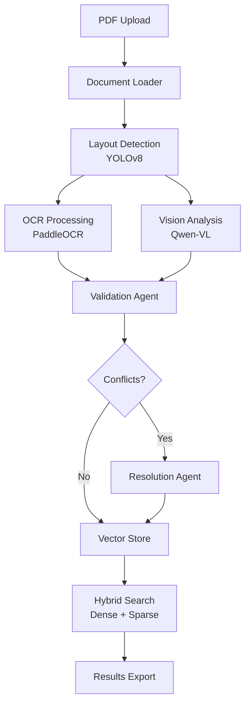

# 📄 Sovereign-Doc

**Zero-Cost, Privacy-First Multi-Modal Document Intelligence System**

> Intelligent document processing combining YOLOv8 layout detection, PaddleOCR text extraction, Qwen-VL vision analysis, and hybrid vector search—all while keeping your data private.

[](https://www.python.org/downloads/)
[](https://opensource.org/licenses/MIT)

---

## 🌟 Features

- **🔍 Multi-Modal Processing**: Combines OCR, vision AI, and layout detection for comprehensive document understanding
- **🔒 Privacy-First**: Process documents locally or use hybrid cloud-brain architecture
- **🎯 Smart Conflict Resolution**: Automatically detects and resolves discrepancies between extraction methods
- **🔎 Hybrid Vector Search**: Dense (BGE) + Sparse (SPLADE) embeddings with RRF fusion
- **📊 Interactive UI**: Streamlit dashboard for document upload, processing, and results export
- **⚡ Hardware-Aware**: Automatically adapts to your system's CPU/RAM/GPU capabilities

---

## 🚀 Quick Start

### Prerequisites

- Python 3.8 - 3.12 (FastEmbed limitation)
- Docker & Docker Compose (for Qdrant)
- **Windows**: poppler (for PDF rendering)
  ```powershell
  # Download from: https://github.com/oschwartz10612/poppler-windows/releases/
  ```
- **macOS**: `brew install poppler`
- **Linux**: `sudo apt-get install poppler-utils`

### Installation

1. **Clone the repository**
   ```bash
   git clone <repository-url>
   cd sober
   ```

2. **Create virtual environment (Python 3.12 recommended)**
   ```bash
   python -m venv .venv312
   # Windows
   .venv312\Scripts\activate
   # Linux/Mac
   source .venv312/bin/activate
   ```

3. **Install dependencies**
   ```bash
   pip install -r requirements.txt
   ```

4. **Start infrastructure**
   ```bash
   docker-compose up -d qdrant
   ```

5. **Run the UI**
   ```bash
   streamlit run app.py
   ```

   Access at: `http://localhost:8501`

---

## 📁 Project Structure

```
sober/
├── app.py                      # Streamlit application entry point
├── config.yaml                 # System configuration
├── requirements.txt            # Python dependencies
│
├── colab_brain/                # Cloud brain for GPU-accelerated vision
│   ├── server.py              # FastAPI server for remote processing
│   └── __init__.py
│
├── local_body/                 # Core processing system
│   ├── agents/                # Processing agents
│   │   ├── layout_agent.py   # YOLOv8 layout detection
│   │   ├── ocr_agent.py      # PaddleOCR text extraction
│   │   ├── vision_agent.py   # Qwen-VL vision analysis
│   │   ├── validation_agent.py # Cross-validation
│   │   └── resolution_agent.py # Conflict resolution
│   │
│   ├── core/                  # Core utilities
│   │   ├── datamodels.py     # Pydantic models (Document, Conflict, etc.)
│   │   ├── config_manager.py # Configuration with hardware detection
│   │   └── logging_setup.py  # Structured logging
│   │
│   ├── database/              # Vector storage
│   │   ├── vector_store.py   # Hybrid dense+sparse search
│   │   └── multi_doc_query.py # Cross-document queries
│   │
│   ├── orchestration/         # Workflow management
│   │   ├── workflow.py       # LangGraph-based pipeline
│   │   ├── state.py          # Processing state management
│   │   ├── nodes.py          # Workflow nodes
│   │   └── resolution_manager.py # Manual conflict resolution
│   │
│   ├── ui/                    # Streamlit UI components
│   │   ├── upload.py         # Upload & configuration
│   │   ├── dashboard.py      # Main processing dashboard
│   │   ├── viewer.py         # PDF viewer with bounding boxes
│   │   ├── conflicts.py      # Conflict resolution interface
│   │   └── results.py        # Export & visualization
│   │
│   └── utils/                 # Utilities
│       ├── hardware.py       # Hardware detection
│       ├── document_loader.py # PDF ingestion
│       ├── image_preprocessor.py # Image enhancement
│       └── temp_manager.py   # Temporary file cleanup
│
└── tests/                     # Comprehensive test suite (197 tests)
    ├── test_vector_store.py
    ├── test_multi_doc_query.py
    ├── test_preprocessing.py
    ├── test_ui_wiring.py
    └── ...
```

---

## 🎯 Core Capabilities

### 1. **Document Processing Pipeline**

```python
from local_body.orchestration.workflow import DocumentWorkflow
from local_body.core.config_manager import ConfigManager

# Initialize
config = ConfigManager().load_config()
workflow = DocumentWorkflow(config)

# Process document
result = await workflow.run("document.pdf")
```

**Stages**:
1. **Ingest** → Load PDF, extract pages
2. **Layout** → YOLOv8 region detection (text/table/chart)
3. **OCR** → PaddleOCR text extraction
4. **Vision** → Qwen-VL semantic analysis
5. **Validation** → Cross-method conflict detection
6. **Resolution** → Auto-resolve or flag for human review

### 2. **Hybrid Vector Search**

```python
from local_body.database.vector_store import DocumentVectorStore

store = DocumentVectorStore(config)

# Hybrid search (Dense BGE + Sparse SPLADE)
results = await store.hybrid_search(
    query_text="total revenue 2023",
    limit=10
)
```

**Features**:
- Dense embeddings: `BAAI/bge-small-en-v1.5` (384 dim)
- Sparse embeddings: `prithivida/Splade_PP_en_v1` (30k vocab)
- RRF fusion for optimal ranking
- Query caching with TTL

### 3. **Multi-Document Querying**

```python
from local_body.database.multi_doc_query import MultiDocumentQuery

query_engine = MultiDocumentQuery(config)

# Cross-document search
results = query_engine.cross_document_search(
    query_text="revenue growth",
    doc_ids=["doc1", "doc2"],
    group_by="document"
)

# Comparative analysis
comparison = query_engine.comparative_analysis(
    field_name="total_revenue",
    doc_ids=["q1_report", "q2_report"]
)

# Trend analysis
trends = query_engine.trend_analysis(
    field_name="net_income",
    doc_ids_ordered=["2021", "2022", "2023"]
)
```

### 4. **Streamlit UI**

**Features**:
- 🖥️ **Hardware-aware** upload with auto-configuration
- 📄 **Three-column dashboard**: Viewer | Results | Conflicts
- 🎨 **Color-coded confidence**: Green (>90%) | Yellow (70-90%) | Red (<70%)
- ⚠️ **Interactive conflict resolution** with visual evidence
- 💾 **Multi-format export**: JSON, Excel, Markdown

---

## 🧪 Testing

### Run All Tests (197 tests)

```bash
# With local Python 3.12
pytest tests/ -v

# With Docker (if using Python 3.13+)
./run_tests_docker.sh  # Linux/Mac
run_tests_docker.bat   # Windows
```

### Test Coverage

- ✅ **Core**: Data models, configuration, logging
- ✅ **Agents**: Layout, OCR, Vision, Validation, Resolution
- ✅ **Database**: Vector store, hybrid search, multi-doc queries
- ✅ **Workflow**: LangGraph orchestration, state management
- ✅ **UI**: Component integration, session state

---

## ⚙️ Configuration

Edit `config.yaml`:

```yaml
# Processing Mode
mode: hybrid  # local | hybrid | cloud

# Qdrant Vector Database
qdrant:
  host: localhost
  port: 6333
  collection: sovereign_docs

# Model Paths
models:
  layout: yolov8n.pt
  ocr: paddleocr
  vision: Qwen/Qwen-VL-Chat

# Thresholds
confidence_threshold: 0.7
conflict_threshold: 0.15

# Hardware
force_cpu: false
batch_size: 5
```

**Environment Variables** (optional):
```bash
export SOVEREIGN_NGROK_URL="https://your-ngrok-url.ngrok.io"
export QDRANT_API_KEY="your-api-key"
```

---

## 🛠️ Development

### Adding a New Agent

1. Inherit from `BaseAgent`:
```python
from local_body.agents.base import BaseAgent

class MyAgent(BaseAgent):
    async def process(self, document: Document) -> Any:
        # Your processing logic
        return result
    
    def confidence_score(self) -> float:
        return 0.95
```

2. Register in workflow (`orchestration/nodes.py`)
3. Add tests in `tests/test_my_agent.py`

### Running UI in Development

```bash
streamlit run app.py --server.runOnSave true
```

---

## 📊 Architecture



---

## 🤝 Contributing

See [CONTRIBUTING.md](CONTRIBUTING.md) for development guidelines.

---

## 📝 License

MIT License - see [LICENSE](LICENSE) for details.

---

## 🙏 Acknowledgments

- **YOLOv8**: Ultralytics for layout detection
- **PaddleOCR**: PaddlePaddle for OCR
- **Qwen-VL**: Alibaba Cloud for vision models
- **Qdrant**: Vector database
- **LangGraph**: Workflow orchestration
- **Streamlit**: UI framework

---

## 📧 Contact

For questions or support, please open an issue on GitHub.

---

**Built with ❤️ for privacy-conscious document processing**
